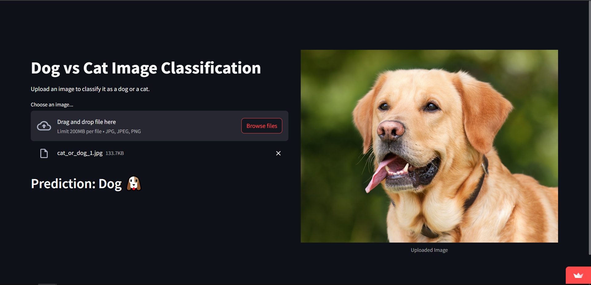
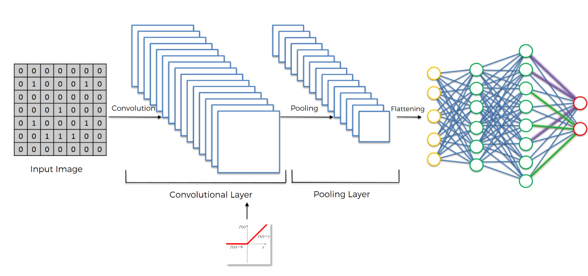

# Dog-Cat Identification
This project utilizes a Convolutional Neural Network (CNN) to classify images of dogs and cats. The model is created in Jupyter Notebook and involves data preprocessing, model building, training, and evaluation.
#### Results
The final model achieves an accuracy of **92%** on the training dataset. The final model achieves an accuracy of **79%** on the validation dataset.
## Table of Contents
1. [Description](#Description)
2. [Project Structure](#Project-Structure)
3. [Libraries Used](#Libraries-Used)
4. [Steps Involved](#Steps-Involved)

### Description
This project aims to build a image classification model that can distinguish between images of dogs and cats. The model is trained using a dataset of labeled images and leverages deep learning techniques to achieve high accuracy.
The project was developed during the process of learning machine learning basics and this was developed during the phase of understanding CNNs.

### Project Structure
* `dataset\`: Dataset used to train the model. [Dataset](https://drive.google.com/drive/folders/1SeC_c-eqUA1eX0b3zLywAKkQKunG9JJd?usp=sharing)
* `dog-cat-identification.ipynb` :  Jupyter Notebook containing the code for data preprocessing, model building, training, and evaluation.
* `dog-cat-identification.py` : Python script for the same purpose.
* `cnn_model.h5`: Pre-trained model file (Model Saved from above files).
* `requirements.txt`: List of required dependencies.
* `favicon.png`: Favicon image for the Streamlit app.
* `app.py`: Streamlit app for an interactive demo.
### Libraries Used
* TensorFlow
* Keras
* NumPy
* Streamlit
### Steps Involved

#### Data Preprocessing
Data preprocessing involves loading containing training and validation sets.
Applying data augmentation techniques and feature scaling to increase the diversity of the training data.
#### Model Architecture
The Convolutional Neural Network (CNN) used in this project consists of several layers: 
* 2 convolutional layer (activation = ReLU)
    * covolution operation
    * pooling layer (Max Pooling)
* Flattening
* Fully connected layer (activation = ReLU)
* Output Layer (activation = Sigmoid)
#### Training the Model
The model is trained using the training dataset, with the following parameters:
* Loss function: Binary Cross-Entropy
* Optimizer: Adam
* Evaluation metric: Accuracy
Training is performed over a number of 25 epochs, with validation at each epoch to monitor performance.
#### Results
The final model achieves an accuracy of **92%** on the training dataset. The final model achieves an accuracy of **79%** on the validation dataset.
